# Amazon ElastiCache for Redis

**Boosting database performance with Amazon ElastiCache for Redis**

Relational databases are a cornerstone of most applications. When it comes to scalability and low latency though, there's only so much you can do to improve performance. Even if you add replicas to scale reads, there's a physical limit imposed by disk based storage. The most effective strategy for coping with that limit is to supplement disk-based databases with in-memory caching.

## Learning goal

In this tutorial, you will learn how to boost the performance of your applications by adding an in-memory caching layer to your relational database. You will implement a cache-aside strategy using Amazon ElastiCache for Redis on top of a MySQL database. The cache-aside strategy is one of the most popular options for boosting database performance. When an application needs to read data from a database, it first queries the cache. If the data is not found, the application queries the database and populates the cache with the result. There are many ways to invalidate the cache if the relevant records are modified in the underlying database, but for this tutorial we will use the Time To Live (TTL) expiration feature provided by Redis.

The ElastiCache for Redis node and the MySQL database created in this tutorial are eligible for the [AWS free tier](https://aws.amazon.com/free/).

**Figure 1**. Implementation of Cache-Aside with Amazon ElastiCache for Redis.

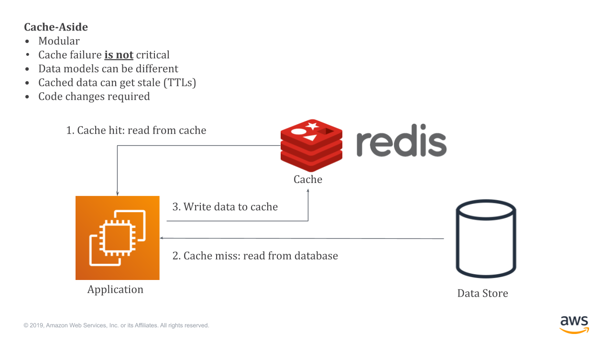

## Requirements

This tutorial illustrates some mechanisms with examples written in Python to illustrate some caching techniques. Hopefully the code will be easy to translate to your language of choice.

In order to complete this tutorial, you need access to an EC2 instance.  If you don't already have one running, follow [these instructions](https://docs.aws.amazon.com/efs/latest/ug/gs-step-one-create-ec2-resources.html) to provision one.

Once you have access to your EC2 instance, run the following commands:

**syntax: shell**

```console
$ sudo yum install git -y
$ sudo yum install mysql -y
$ sudo yum install python3 -y
$ pip3 install --user virtualenv
$ git clone https://github.com/aws-samples/amazon-elasticache-samples/
$ cd amazon-elasticache-samples/database-caching
$ virtualenv venv
$ source ./venv/bin/activate
$ pip3 install -r requirements.txt
```

Now you are all set to start the tutorial.

# Step 1: Create a Redis Cluster

Open the [ElastiCache Dashboard](https://console.aws.amazon.com/elasticache/), then:

### 1.1 — On the top right corner, select the region where launched your EC2 instance.


### 1.2 — Click on "Get Started Now".


### 1.3 — Select "Redis" as your Cluster engine.


### Redis settings

### 1.4 — Choose a name for your Redis Cluster, e.g. "elc-tutorial".


### 1.5 — Change the Node type to cache.t2.micro.

That node type is fine for this tutorial, but for a production cluster the size of the node should depend on your workload and you should start with the m5 or r5 instance families.


### 1.6 — In Number of replicas, select 1.

That read-only replica will allow you to scale your reads. In case of a failure, an automatic failover will be triggered and the replica will take over the role of the master node.


## Advanced Redis settings

### 1.7 — Check the box for "Multi-AZ with Auto-Failover".

In the unlikely event of a primary node or Availability Zone failure, or even in cases of planned maintenance, ElastiCache for Redis can replace the failing instance and the replica takes over the role of the primary node. As a result, downtime is minimized.


### 1.8 — Select a Subnet group. If you need more information about Subnet groups, please refer to [the documentation](https://docs.aws.amazon.com/AmazonElastiCache/latest/red-ug/SubnetGroups.Creating.html).


### 1.9 — For Preferred availability zone(s), select "No preference".


Each node will be created in a different availability zone. This is a best practice for improved reliability.

## Configure the Security settings

For this example we won't use encryption, but keep in mind you can configure both encryption for data at-rest and for data in-transit.

### 1.10 — Select a Security group for your Redis Cluster.


This is important: make sure the Security group you select allows incoming TCP connections on port 6379 from your EC2 instance. If that's not the case, you won't be able to connect to your Redis nodes.

## Import data to cluster

For this example, we won't load any seed RDB file so we can skip this configuration step altogether. Just keep in mind that this option is available.

## Configure backups

Daily backups are important for most use cases, and a good recommendation is to enable backups with a retention period that will give you enough time to act in case anything unexpected happens. For this tutorial, we won't use any backups.

### 1.11 — Uncheck "Enable automatic backups".


## Maintenance settings

### 1.12 — Specify a maintenance window that suits your needs.

For this tutorial, it suffices to specify "No preference".


Here you can think about the time and day when your application has a low workload. For our current needs, we can just state "No preference".

### Review and create

After a quick review of all the fields in the form, you can hit "Create".

### 1.13 — Click on "Create".


A Redis Cluster will get initialized.

# Step 2: Create a MySQL database

### 2.1  - Open a browser and navigate to [Amazon RDS console](https://console.aws.amazon.com/rds/home).

### 2.2 — On the top right corner, select the region where you want to launch the Aurora DB cluster.


### 2.3 — Click on "Create database" in the Amazon Aurora window.

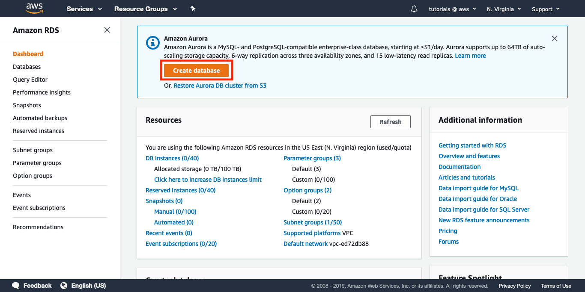

Before continuing, switch to the new database creation flow if the option appears:

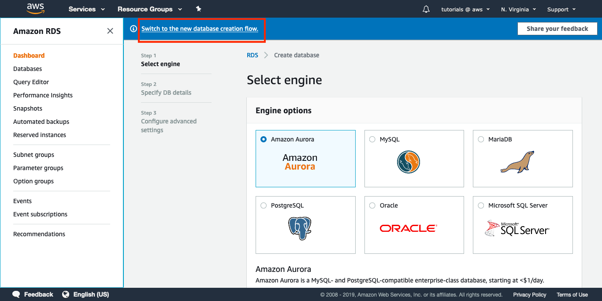

## Engine options

### 2.4 — On Database engine, select "MySQL".

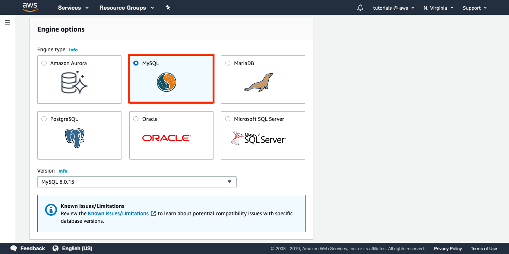

### 2.5 — On Version, select the most recent MySQL version.

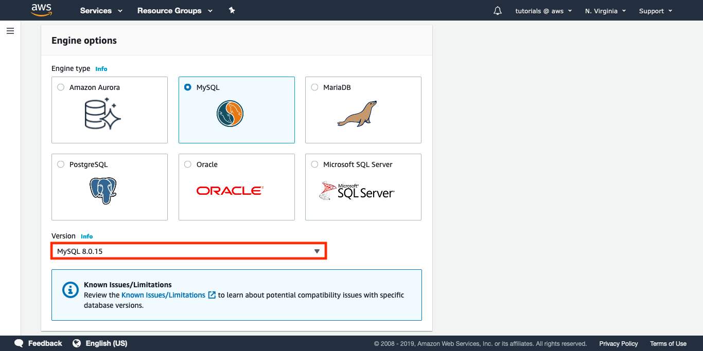

## Templates

### 2.6 — Select "Free tier".

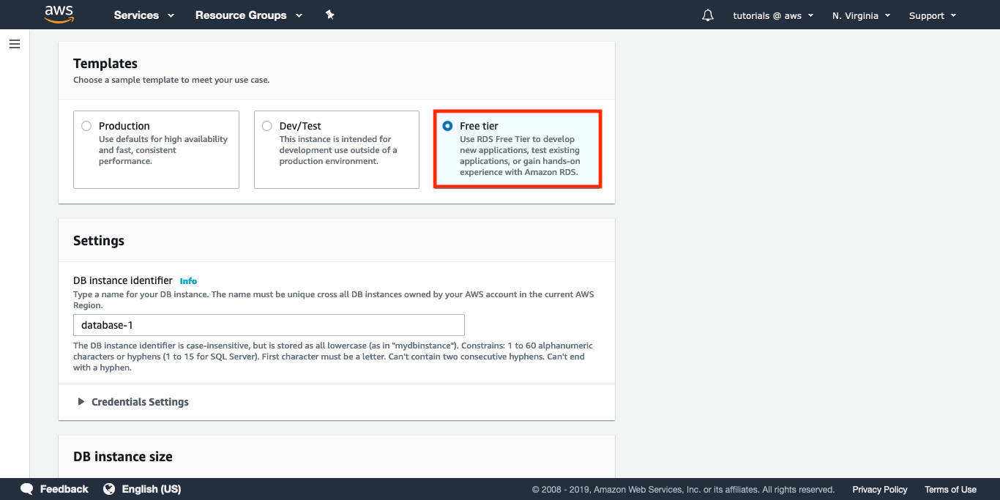

## Settings

### 2.7 — Choose an identifier for your MySQL database, e.g. "database-1".

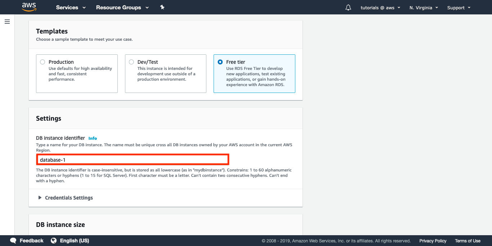

## DB instance size

### 2.8 — Select db.t2.micro.

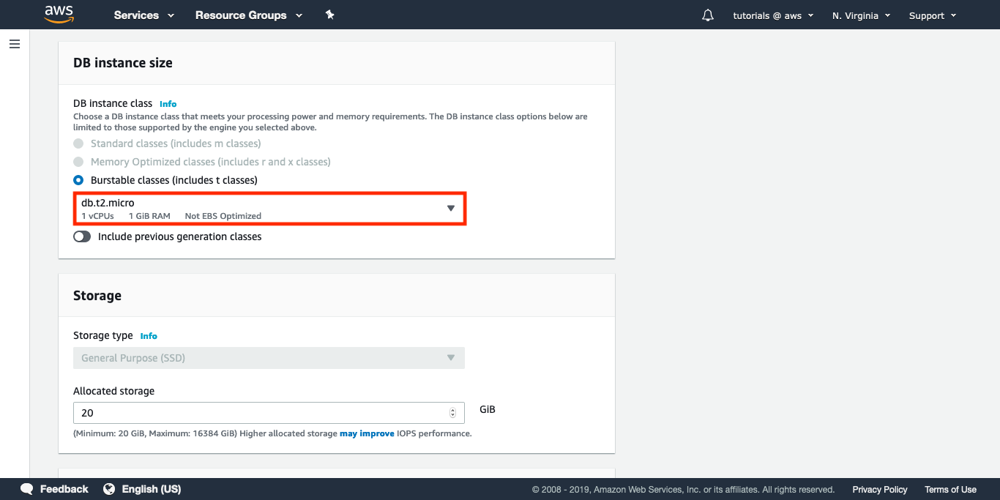

## Storage

You can leave the default value.

## Connectivity

### 2.9 — Select the VPC where you want to create the database.

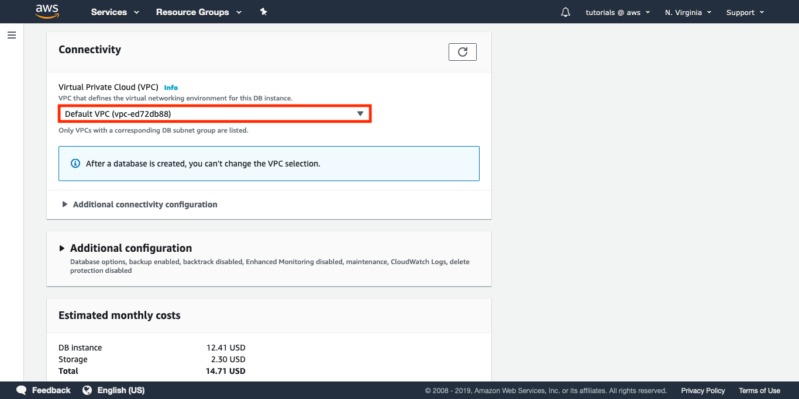

Note that once created, a database can't be migrated to a different VPC.

### 2.10 — Click on "Additional connectivity configuration".

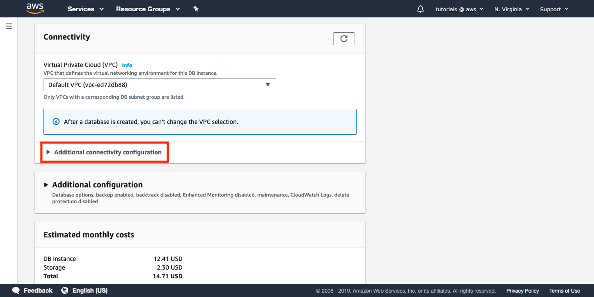

### 2.11 — Select the default value for Subnet group.

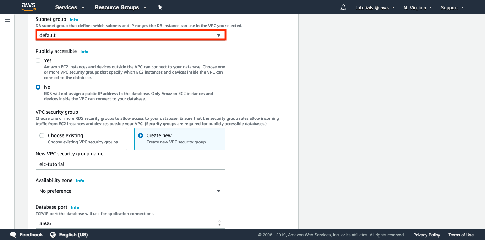

### 2.12 — On Publicly accessible, select "No".

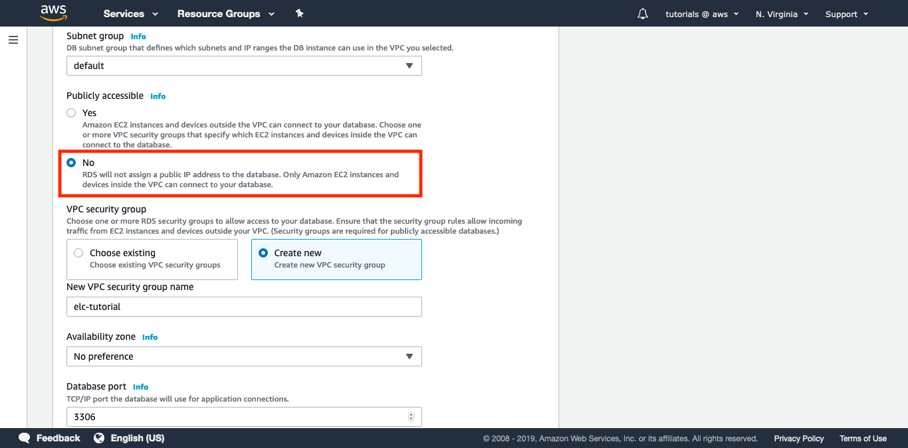

This means you will have to connect to the database from an EC2 instance within the same VPC.

### 2.13 — On VPC security group, select "Create new".

If you happen to have a security group that allows incoming TCP connections on port 3306, you can choose it instead.

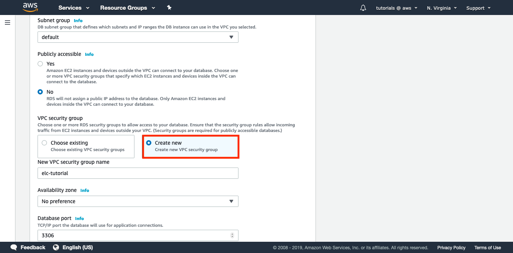

### 2.14 — In New VPC security group name, type "elc-tutorial".

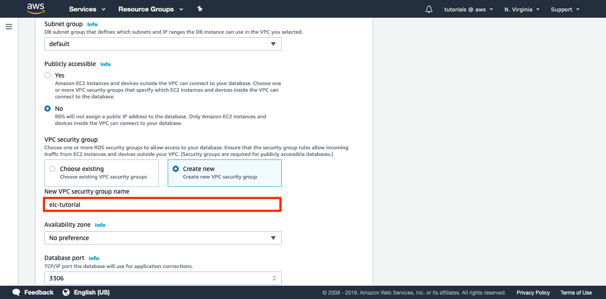

### 2.15 — Leave the default value for Database port.

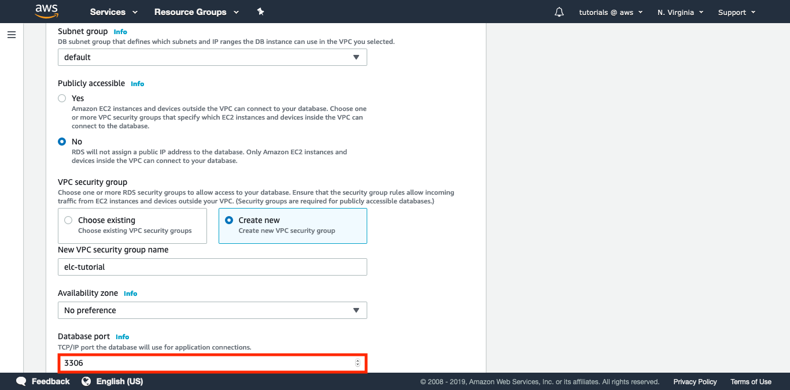

## Additional configuration

Leave the default values for "Additional configuration".

The best practice is to enable the Deletion protection. If you want to delete the database at the end of the tutorial, you can leave the option unchecked.

### 2.16 — On "Deletion protection", uncheck “Enable deletion protection”.

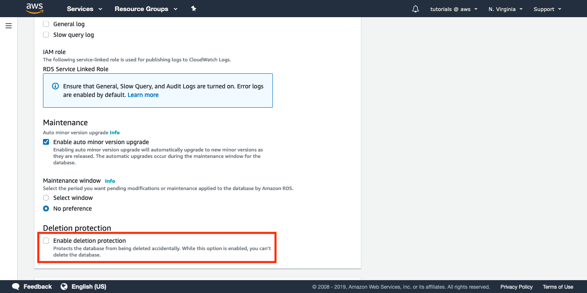

## Review and create

After a quick review of all the fields in the form, you can proceed.

### 2.17 — Click on "Create database".

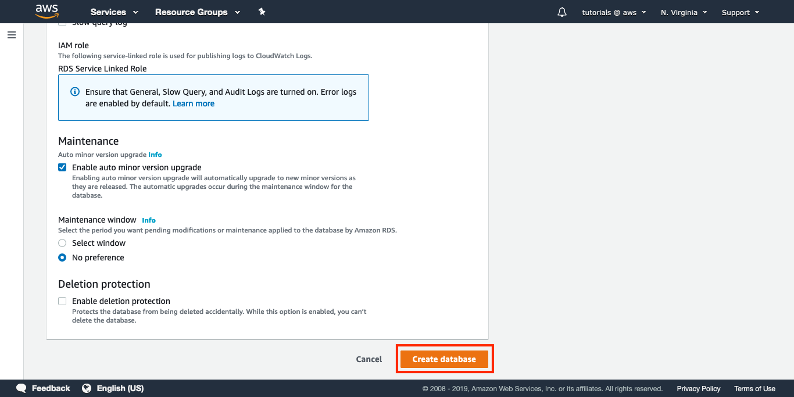

While the instances are being created, you will see a banner explaining how to obtain your credentials. This is a good opportunity to save the credentials somewhere, as this is the only time you will be able to view this password.

### 2.18 — Click on "View credential details".

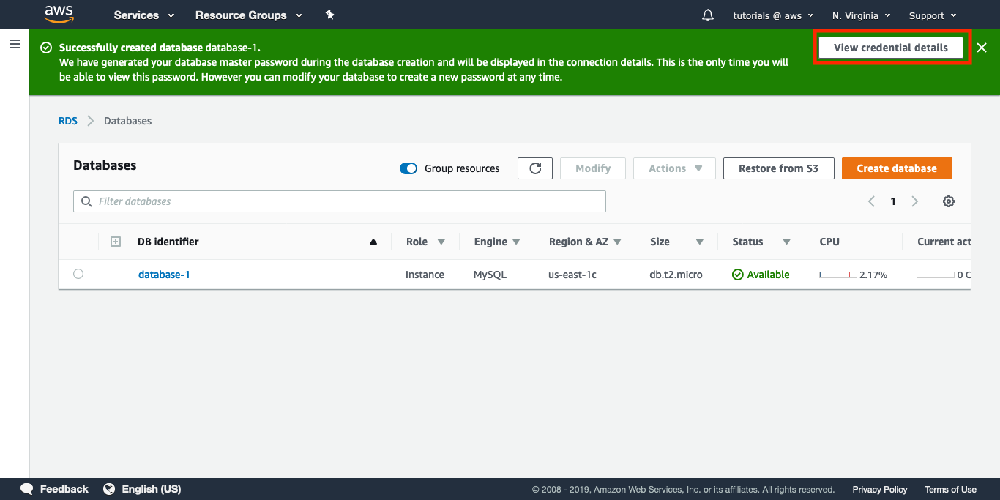

### 2.19 — Save the username, password, and endpoint.

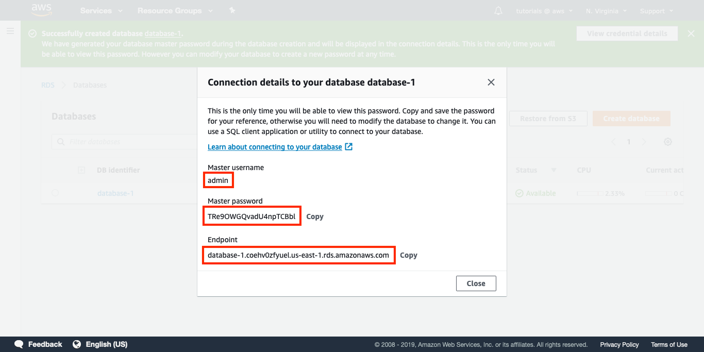

# Step 3: Populate your MySQL database

You can populate the database with the [seed.sql](./seed.sql) file provided in the [tutorial repository](./). Log into your EC2 instance and run this command:

**syntax: shell**

```console
$ mysql -h endpoint -P 3306 -u admin -p < seed.sql
```

If the command hangs, chances are you are being blocked by the Security Group settings. Verify that your EC2 instance has access to the security group assigned to your MySQL instance. For example, let's say your EC2 instance was assigned to the default security group. You can now modify the security group of your MySQL instance, edit the Inbound rules and add a MYSQL/Aurora rule allowing connections on port 3306 from any instance in the default security group:


In Source, you can start typing the name of the security group and you'll be able to click on the Security Group ID. If you need to learn more about Security Groups, you can check [the documentation](https://docs.aws.amazon.com/vpc/latest/userguide/VPC_SecurityGroups.html) or the [Security Group Rules Reference](https://docs.aws.amazon.com/AWSEC2/latest/UserGuide/security-group-rules-reference.html).

Below is a breakdown of the commands contained in the [seed.sql](./seed.sql) file. If you succeeded in populating the database, you can skip the steps below and go directly to step 4.

### 3.1 — Connect to your database:

**syntax: shell**

```console
$ mysql -h endpoint -P 3306 -u admin -p
```

When prompted for a password, enter the password you saved in step 2.19.

### 3.2 — Create a database.

**syntax: SQL**

```sql
mysql> CREATE database tutorial;

Query OK, 1 row affected (0.01 sec)
```

At this point you can use the tutorial database, create tables and add some records.

**syntax: SQL**

```SQL
mysql> USE tutorial;

Database changed

mysql> CREATE TABLE planet (
    -> id INT UNSIGNED AUTO_INCREMENT,
    -> name VARCHAR(30),
    -> PRIMARY KEY(id));

Query OK, 0 rows affected (0.057 sec)

mysql> INSERT INTO planet (name) VALUES ("Mercury");

Query OK, 1 row affected (0.008 sec)

mysql> INSERT INTO planet (name) VALUES ("Venus");

Query OK, 1 row affected (0.011 sec)

mysql> INSERT INTO planet (name) VALUES ("Earth");

Query OK, 1 row affected (0.009 sec)

mysql> INSERT INTO planet (name) VALUES ("Mars");

Query OK, 1 row affected (0.009 sec)

mysql> INSERT INTO planet (name) VALUES ("Jupiter");

Query OK, 1 row affected (0.008 sec)

mysql> INSERT INTO planet (name) VALUES ("Saturn");

Query OK, 1 row affected (0.010 sec)

mysql> INSERT INTO planet (name) VALUES ("Uranus");

Query OK, 1 row affected (0.009 sec)

mysql> INSERT INTO planet (name) VALUES ("Neptune");

Query OK, 1 row affected (0.009 sec)
```

In the next steps you will use the planet table in the tutorial database.

# Step 4: Caching and Best Practices

You will learn two techniques for storing and retrieving data. When choosing which method to use in your application, select the one that simplifies your architecture based on your data access patterns.

But first, make sure you can connect to Redis.

## Test your connection to Redis

Back at the [ElastiCache Dashboard](https://console.aws.amazon.com/elasticache/):

### 4.1 — Select "Redis" on the left pane.


### 4.2 — Select the Redis Cluster you created for this tutorial.

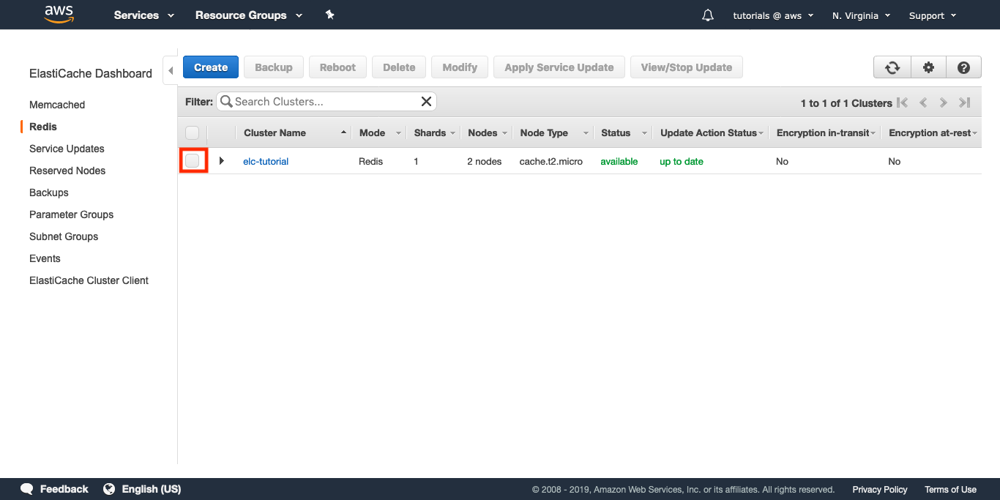

### 4.3 — Copy the Primary Endpoint.


In the examples, each time an endpoint is mentioned you should use the hostname of your Configuration Endpoint.

### 4.4 — From your EC2 instance, enter the Python interactive interpreter:

**syntax: shell**

```console
$ python
```

### 4.5 — Now run these commands to test the connection to your Redis node.

If the commands hang, please see the note following the example.

**syntax: python**

```python
>>> import redis
>>> client = redis.Redis.from_url('redis://endpoint:6379')
>>> client.ping()

True
```

Note: If it hangs, it means you are being blocked by the Security Group settings. Verify that your EC2 instance has access to the security group assigned to your ElastiCache instance. For example, let's say your EC2 instance was assigned to the default security group. You can now modify the security group of your Amazon ElastiCache instance and add a Custom TCP rule allowing connections on port 6379 from any instance in the default security group:


In Source, you can start typing the name of the security group and you'll be able to click on the Security Group ID. If you need to learn more about Security Groups, you can check [the documentation](https://docs.aws.amazon.com/vpc/latest/userguide/VPC_SecurityGroups.html) or the [Security Group Rules Reference](https://docs.aws.amazon.com/AWSEC2/latest/UserGuide/security-group-rules-reference.html).

## Configure the environment

In the [repository](./) you will find some [Python code](./example.py) that you can run in your EC2 instance. But first you need to configure some environment variables:

**syntax: shell**

```console
$ export REDIS_URL=redis://your_redis_endpoint:6379/
$ export DB_HOST=your_mysql_endpoint
$ export DB_USER=admin
$ export DB_PASS=your_admin_password
$ export DB_NAME=tutorial
```

Note that the values for mysql_endpoint, redis_endpoint, and password are those that you saved in the previous steps.

## Cache the result of a SQL query

The first of the two methods implemented in the code sample works by caching a serialized representation of the SQL query result. The following Python snippet illustrates the logic:

**syntax: python**

```python
def fetch(sql):

  result = cache.get(sql)
  if result:
    return deserialize(result)
  else:
    result = db.query(sql)
    cache.setex(sql, ttl, serialize(result))
    return result
```

First, the SQL statement is used as a key in Redis, and the cache is examined to see if a value is present. If a value is not present, the SQL statement is used to query the database. The result of the database query is stored in Redis. The ttl variable must be set to a sensible value, dependent on the nature of your application. When the ttl expires, Redis evicts the key and frees the associated memory. This code is available in the tutorial repository and you can run it as is, but feel free to add print statements here and there if you want to see the value of a variable at a certain point in time.

In terms of strategy, the drawback of this approach is that when data is modified in the database, the changes won't be reflected automatically to the user if a previous result was cached and its ttl has not elapsed yet.

An example of how you would use the fetch function:

**syntax: python**

```python
print(fetch("SELECT * FROM planet"))
```

The result would be:

**syntax: python**
```python
[{'id': 10, 'name': 'Mercury'},
 {'id': 11, 'name': 'Venus'},
 {'id': 12, 'name': 'Earth'},
 {'id': 13, 'name': 'Mars'},
 {'id': 14, 'name': 'Jupiter'},
 {'id': 15, 'name': 'Saturn'},
 {'id': 16, 'name': 'Uranus'},
 {'id': 17, 'name': 'Neptune'}]
 ```

Of course, this is a very basic example, but your application can benefit a great deal by implementing this caching pattern where there's no difference between a result coming from the cache and a result coming straight from the database.

## Cache a record as a Redis hash

The second example you will implement maps a database record to a Redis hash:

**syntax: python**

```python
def planet(id):

  key = "planet:" + str(id)
  result = cache.hgetall(key)

  if result:
      return result

  else:
      sql = "SELECT `id`, `name` FROM `planet` WHERE `id`=%s"
      result = db_record(sql, (id,))

      if result:
          cache.hmset(key, result)
          cache.expire(key, ttl)
      return result
```

The keyspace in Redis is flat, but there's a convention for simulating structure by using colon separated strings. In the example, the key for the record with ID 1 will be with "planet:1". While this snippet is good enough for exhibiting a common pattern, more abstraction is possible: one module could be in charge of generating the keys, another could take care of building the SQL string, etc. Furthermore, chances are there are tools built for that purpose in the programming language you use.

The example retrieves records either from the cache or from the database, and similarly there could be a function in charge of persisting an object to the database.

## Expire content

In the two examples you used a Time To Live or  ttl, after which Redis evicts the key. While this is good enough in most cases, you may want to remove stale data from the cache as soon as possible. If that's your use case, make sure you check other options like the write-through caching strategy. Links for more information are provided at the end of this tutorial. Worth mentioning in case you are curious: while the examples use the EXPIRE command, Redis also provides the EXPIREAT, which lets you specify a precise date and time when a key should be evicted. It takes as a parameter an absolute Unix timestamp (i.e., seconds elapsed since January 1, 1970).

## Configure Redis as a cache

When the amount of data exceeds the configured maxmemory setting, Redis has different ways of responding depending on the selected eviction policy. By default, ElastiCache for Redis is configured to remove from memory the least recently used keys with a ttl set. The eviction policy parameter is called maxmemory-policy, and the default value in ElastiCache is volatile-lru. Another interesting option for this use case is the volatile-ttl policy, which instructs Redis to reclaim memory by removing those keys with the shortest ttl.

## Test

Once you have implemented this strategy, make sure to test your application to find the best value for the ttl and the best eviction strategy. Check the performance of your application with an empty cache and with a full cache.

# Step 5: Cleanup

To finish this experiment, you will learn how to delete your Redis Cluster and your MySQL database when they are not needed anymore.

## Delete your Redis Cluster

In order to delete your Redis Cluster, go to the [ElastiCache Dashboard](https://console.aws.amazon.com/elasticache/) and follow these instructions:

### 5.1 — Select "Redis" on the left pane.


This will show you a list of all your Redis clusters. 

### 5.2 — Select the Redis Cluster you created for this tutorial.


### 5.3 — Click on "Delete".


### 5.4 — You will be asked if you want to create a final backup.

That's usually a good idea, but it's not necessary for this tutorial. Select "No" and click on “Delete”.

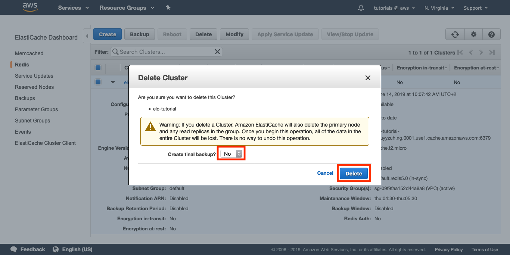

The status of your cluster will change to "deleting".

## Delete your MySQL database

### 5.5 — Navigate to [Amazon RDS console](https://console.aws.amazon.com/rds/home) and select "Databases" on the left pane.

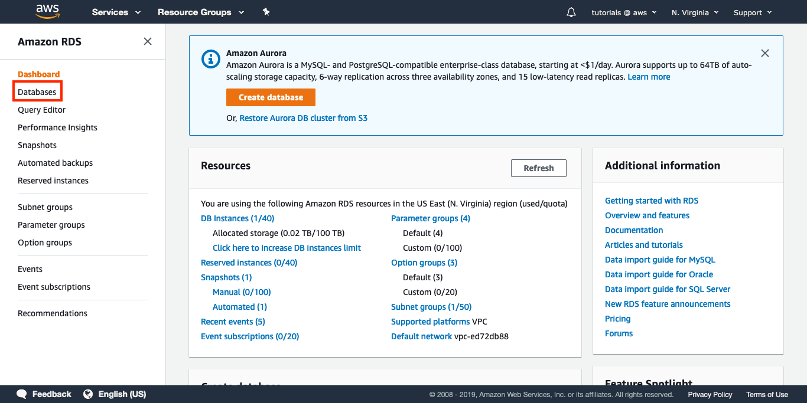

### 5.6 — Select the database you created (i.e., "database-1").

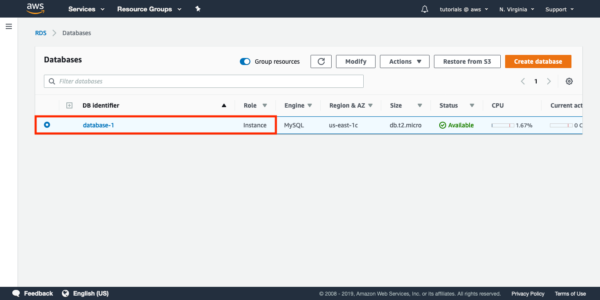

### 5.7 — Click on "Actions" and select “Delete”.

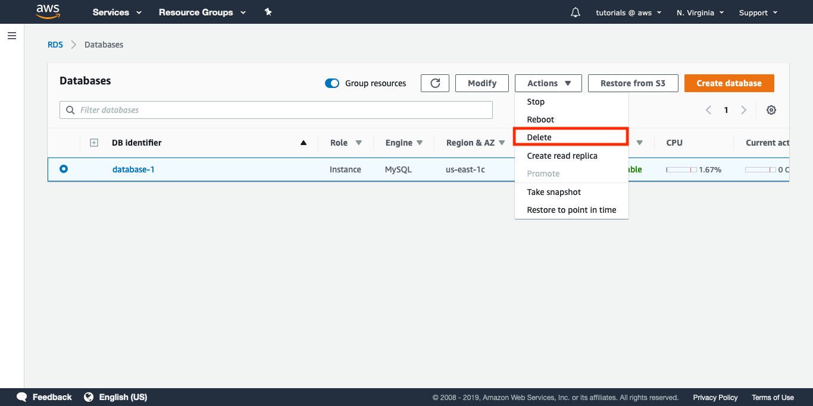

### 5.8 — You will be asked if you want to create a final backup.

That's usually a good idea, but it's not necessary for this tutorial. Uncheck the box for "Create final snapshot".

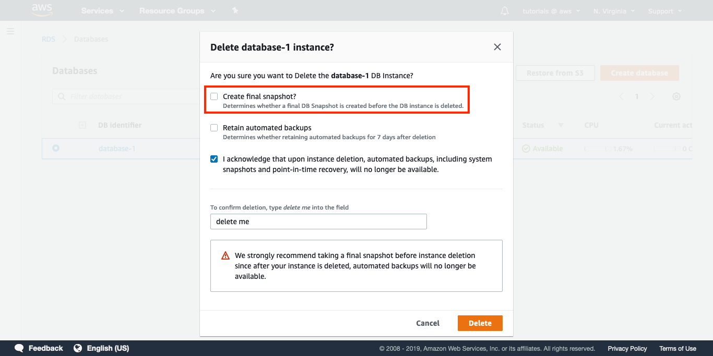

### 5.9 — Check the box for "I acknowledge...", type “delete me”, and click “Delete”.

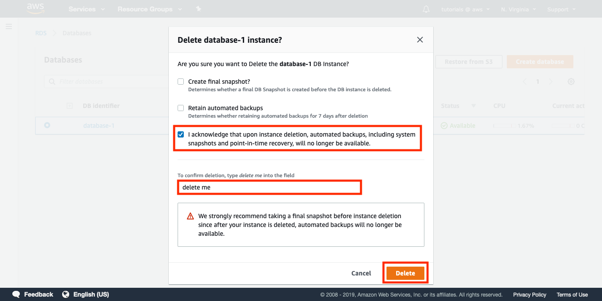

## Congratulations!

You have learnt how to boost your relational databases with ElastiCache for Redis. You implemented a cache-aside strategy with a Redis Cluster on top of a MySQL database.

## Next Steps

If you want to learn more about caching in AWS, read this [Caching Overview](https://aws.amazon.com/caching/) and make sure you check the documentation for [Database Caching](https://aws.amazon.com/caching/database-caching/). For real time applications, review our [Best Practices for High Availability](https://aws.amazon.com/blogs/database/configuring-amazon-elasticache-for-redis-for-higher-availability/). The code samples can be found in [this repository](https://github.com/aws-samples/amazon-elasticache-samples/database-caching/).

| About this Tutorial  |                                                            | 
| -------------------- | ---------------------------------------------------------- |
| Time                 | 120 minutes                                                |
| Cost                 | Free Tier Eligible                                         |
| Use Case             | Scaling, High Availability, Real-time application          |
| Products             | Amazon ElastiCache for Redis, AWS Free Tier, Amazon Aurora |
| Audience             | Developers                                                 |
| Level                | Beginner                                                   |
| Last Updated         | July 25, 2019                                              |

